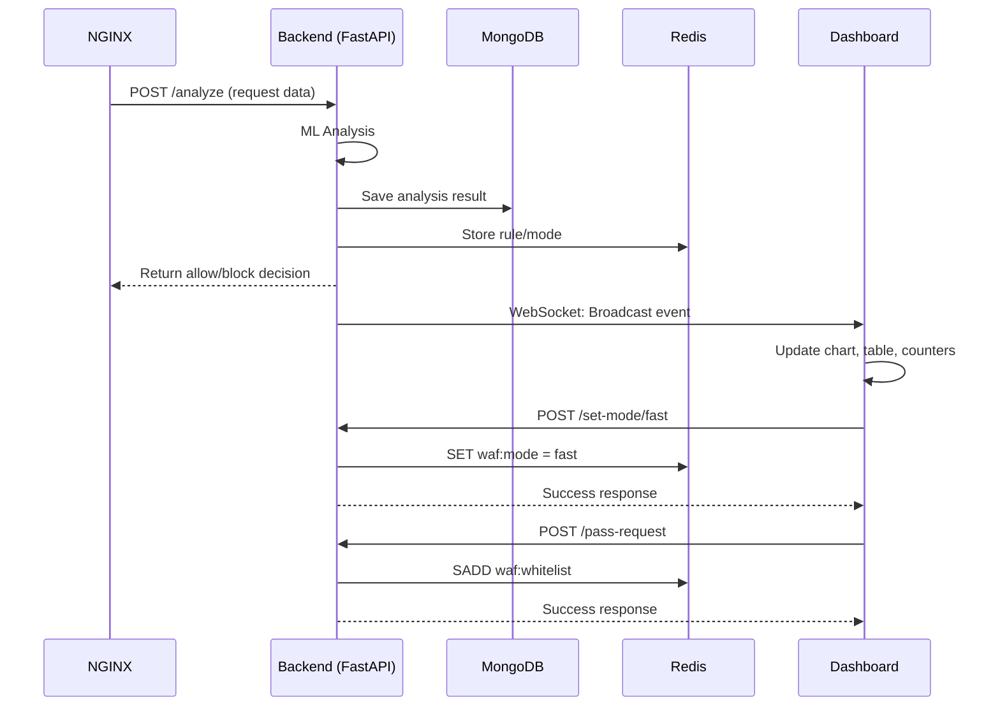

# 🛡️ WAF Dashboard - Backend Integration

## Quick Start

The WAF Dashboard is now **fully integrated** with your FastAPI backend! Here's how to get started:

### **Option 1: Automated Startup (Recommended)**

```powershell
# Run the quick start script
powershell -ExecutionPolicy Bypass -File quick-start.ps1
```

This script will:
1. Check all prerequisites
2. Start the FastAPI backend
3. Open the dashboard in your browser
4. Show you all the important URLs

### **Option 2: Manual Startup**

```powershell
# Terminal 1: Start backend
python main.py

# Terminal 2: Open dashboard
start waf_heartbeat_dashboard.html

# Terminal 3: Run tests
powershell -ExecutionPolicy Bypass -File test-dashboard-integration.ps1
```

---

## 📁 New Files

### **Dashboard Files**
- `dashboard-api.js` - API communication module
- `dashboard-integrated.js` - Main dashboard with backend integration
- `waf_heartbeat_dashboard.html` - Updated HTML (uses new JS files)
- `styles.css` - Light theme styles

### **Documentation**
- `DASHBOARD_INTEGRATION_GUIDE.md` - Complete integration guide
- `API_REFERENCE.md` - Backend API documentation

### **Scripts**
- `quick-start.ps1` - One-command startup
- `test-dashboard-integration.ps1` - Integration test suite

---

## 🌟 Key Features

### **Real-Time Updates**
✅ **WebSocket connection** to backend  
✅ **Live chart** updates as requests are analyzed  
✅ **Auto-reconnect** if connection is lost  
✅ **Event table** with full request details  

### **WAF Control**
🔧 **Change modes** via UI (Transformer Only / Full WAF / Off)  
✅ **Whitelist requests** with one click  
📊 **View metrics** (benign, malicious, total)  

### **Monitoring**
💓 **System health** indicators  
📝 **Live logs** with color-coded severity  
🔄 **Manual refresh** (Ctrl+R)  

---

## 🔗 Integration Points

### **Backend → Dashboard Communication**

```
┌─────────────┐
│   Browser   │
│  Dashboard  │
└──────┬──────┘
       │
       │ WebSocket (ws://localhost:8001/ws/logs)
       │
       ▼
┌──────────────┐
│   FastAPI    │
│   Backend    │
│  (main.py)   │
└──────┬───────┘
       │
       ├──→ MongoDB (analysis_logs)
       └──→ Redis (waf:mode, waf:rules)
```

### **API Endpoints Used**

| Endpoint | Purpose | Dashboard Action |
|----------|---------|------------------|
| `GET /health` | Check backend status | Health indicator dots |
| `POST /analyze` | Analyze request | (Called by NGINX, not dashboard) |
| `POST /set-mode/{mode}` | Change WAF mode | WAF mode toggle buttons |
| `POST /pass-request` | Whitelist request | "Allow" button click |
| `WS /ws/logs` | Real-time updates | Continuous WebSocket connection |

---

## 🧪 Testing

### **1. Run Integration Tests**

```powershell
powershell -ExecutionPolicy Bypass -File test-dashboard-integration.ps1
```

This tests:
- ✅ Health check
- ✅ WAF mode changes
- ✅ Benign request analysis
- ✅ Malicious request detection
- ✅ Stress test (10 requests)

### **2. Send Manual Test Requests**

```powershell
# Benign request
$body = @{
    method = "GET"
    path = "/api/users"
    protocol = "HTTP/1.1"
    request_body = "page=1"
} | ConvertTo-Json

Invoke-RestMethod -Uri "http://localhost:8001/analyze" -Method Post -Body $body -ContentType "application/json"
```

```powershell
# Malicious request
$body = @{
    method = "POST"
    path = "/admin"
    protocol = "HTTP/1.1"
    request_body = "'; DROP TABLE users; --"
} | ConvertTo-Json

Invoke-RestMethod -Uri "http://localhost:8001/analyze" -Method Post -Body $body -ContentType "application/json"
```

### **3. Watch Dashboard React**
- Chart updates in real-time
- Counter increments
- New row appears in table
- Log entry added

---

## 🐛 Troubleshooting

### **Dashboard not connecting?**

```powershell
# Check if backend is running
Invoke-RestMethod -Uri "http://localhost:8001/health"
```

**Solutions:**
- Start backend: `python main.py`
- Check port 8001 is not blocked
- Look for errors in browser console (F12)

### **No events showing?**

1. Check browser console for WebSocket errors
2. Verify backend logs for connection attempts
3. Send a test request manually
4. Check Redis and MongoDB are running

### **CORS errors?**

- Ensure `main.py` has CORS middleware configured
- Try accessing via `http://localhost` instead of `file://`
- Serve via Python: `python -m http.server 8080`

---

## 📊 Data Flow



---

## 🎯 Next Steps

1. **✅ Test Integration**
   ```powershell
   powershell -ExecutionPolicy Bypass -File test-dashboard-integration.ps1
   ```

2. **📖 Read Full Guide**
   - Open `DASHBOARD_INTEGRATION_GUIDE.md`
   - Check `API_REFERENCE.md`

3. **🎨 Customize**
   - Modify colors in `styles.css`
   - Adjust chart settings in `dashboard-integrated.js`
   - Add new features to `dashboard-api.js`

4. **🚀 Deploy**
   - Use HTTPS/WSS for production
   - Add authentication
   - Configure proper CORS
   - Set up monitoring

---

## 📝 Configuration

### **Change Backend URL**

Edit `dashboard-integrated.js`:

```javascript
this.config = {
    apiBaseUrl: 'http://YOUR_SERVER:8001',  // Change this
    wsUrl: 'ws://YOUR_SERVER:8001/ws/logs'   // And this
};
```

### **Change Update Intervals**

```javascript
this.config = {
    maxDataPoints: 100,        // Number of points on chart
    updateInterval: 5000,      // Health check interval (ms)
};
```

---

## 🔒 Security Notes

⚠️ **Development Mode**
- Currently uses `ws://` (unencrypted WebSocket)
- CORS allows `localhost` origins
- No authentication required

✅ **Production Recommendations**
- Use `wss://` (encrypted WebSocket)
- Implement JWT/OAuth authentication
- Restrict CORS origins
- Use API keys
- Enable rate limiting
- Monitor access logs

---

## 📞 Support

### **Logs to Check**
1. **Backend logs**: Terminal running `main.py`
2. **Browser console**: F12 → Console tab
3. **Network tab**: F12 → Network tab
4. **MongoDB logs**: `mongod.log`
5. **Redis logs**: `redis-server.log`

### **Useful Commands**

```powershell
# Check backend health
Invoke-RestMethod -Uri "http://localhost:8001/health"

# Test WebSocket (JavaScript in browser console)
ws = new WebSocket('ws://localhost:8001/ws/logs');
ws.onmessage = (e) => console.log(JSON.parse(e.data));

# Check Redis
redis-cli GET waf:mode
redis-cli SMEMBERS waf:whitelist

# Check MongoDB
mongosh --eval "use waf_db; db.analysis_logs.find().limit(5)"
```

---

## 🎉 Success!

Your WAF Dashboard is now fully integrated with the backend!

**What you can do:**
- ✅ See real-time security events
- ✅ Control WAF mode from UI
- ✅ Whitelist false positives
- ✅ Monitor system health
- ✅ View detailed logs

**Start monitoring your web application firewall!** 🛡️

---

## 📚 Additional Resources

- [FastAPI Documentation](https://fastapi.tiangolo.com/)
- [Chart.js Documentation](https://www.chartjs.org/docs/)
- [WebSocket API](https://developer.mozilla.org/en-US/docs/Web/API/WebSocket)
- [MongoDB Documentation](https://docs.mongodb.com/)
- [Redis Documentation](https://redis.io/documentation)

---

**Made with ❤️ for WireFall WAF**
